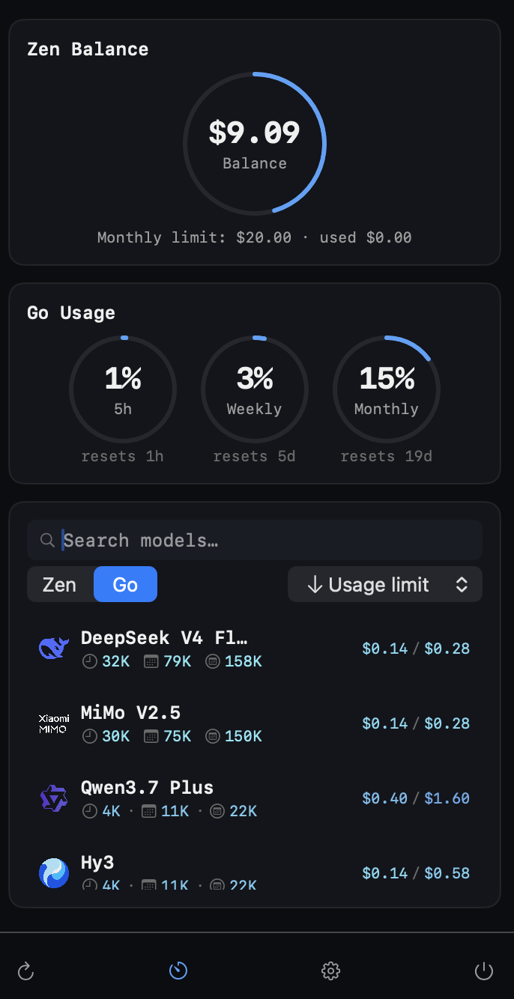

# Dandelion

A native macOS menu bar app for **OpenCode Zen** (pay-as-you-go) and **OpenCode Go** (subscription) - your live balance/usage at a glance, plus the full model catalog with pricing and limits, no browser or CLI required.


## Purpose

Dandelion is a **Zen/Go-only**, fully graphical dashboard, styled as a custom dark/monospace/teal "terminal" panel instead of a plain dropdown. It answers three questions without opening a browser:

- How much is left in my Zen balance, and what's my auto-reload threshold / monthly limit?
- How much of my Go 5h/weekly/monthly usage window have I used, and when does it reset?
- What do all Zen/Go models cost (input/output/cache read/cache write per 1M tokens) and what are their context/output limits?

<p align="center">
  
</p>

## Architecture

Dandelion is a Swift / SwiftUI, menu-bar-only app (no Dock icon, no CLI target).

```
Status bar icon 
        │ click
        ▼
Floating panel (custom content)
        ├── Zen Balance Card  ──┐
        ├── Go Usage Card       ├── refresh coordinator (parallel fetch)
        ├── Model Catalog View  │        + auto-refresh timer + manual refresh
        └── Settings ───────────┘
```

Because the live balance/usage endpoints are undocumented and can change without notice, every widget degrades gracefully to a "—" fallback instead of crashing when discovery or parsing fails.

## Requirements

- macOS 26 ("Tahoe") or later
- Xcode 26+ (full IDE, not just Command Line Tools)
- [XcodeGen](https://github.com/yonaskolb/XcodeGen) to generate the `.xcodeproj` from `project.yml` (`brew install xcodegen`)
- An OpenCode account already connected on this machine (i.e. `~/.local/share/opencode/auth.json`)

## Running locally

The `.xcodeproj` is generated from `project.yml`, so it's not checked in - generate it first:

```bash
brew install xcodegen   # if not already installed
cd dandelion
xcodegen generate
open Dandelion.xcodeproj
```

Then in Xcode: select the **Dandelion** scheme and press **Run** (⌘R). 

You can also build/run from the terminal instead of the Xcode UI:

```bash
xcodebuild -project Dandelion.xcodeproj -scheme Dandelion -configuration Debug build
open ~/Library/Developer/Xcode/DerivedData/Dandelion-*/Build/Products/Debug/Dandelion.app
```

### First-run permissions

- **Zen/Go catalog and key validation** work immediately as long as `auth.json` has your keys - no extra permission prompts.
- **Live Zen balance / Go usage** additionally need read access to your browser's cookie store: Chromium-based browsers (Chrome/Brave/Arc/Edge) prompt for Keychain access to decrypt cookies. 

## Installing

### Via Homebrew

```bash
brew tap Yyukan/dandelion https://github.com/Yyukan/dandelion
brew install --cask dandelion
```

This drops a prebuilt `Dandelion.app` straight into `/Applications` - no Xcode required. Since the build isn't notarized, the first launch still needs a right-click → **Open** (or an allow in System Settings → Privacy & Security → Security) to bypass Gatekeeper.

### From source

Building it yourself and copying the app out of Xcode's build output. The `install.sh` script wraps the whole flow:

```bash
./install.sh
```

This runs `xcodegen generate`, a Release build, copies `Dandelion.app` to `/Applications`, and opens it.

### Cutting a release (maintainers)

`release.sh` builds a Release configuration, zips `Dandelion.app` into `Dandelion.zip`, and prints its sha256:

```bash
./release.sh
```

Attach the resulting `Dandelion.zip` to a GitHub Release tagged to match the `version` in `Casks/dandelion.rb`, then replace that Cask's `sha256` with the printed hash.

## License

See [LICENSE](LICENSE).
